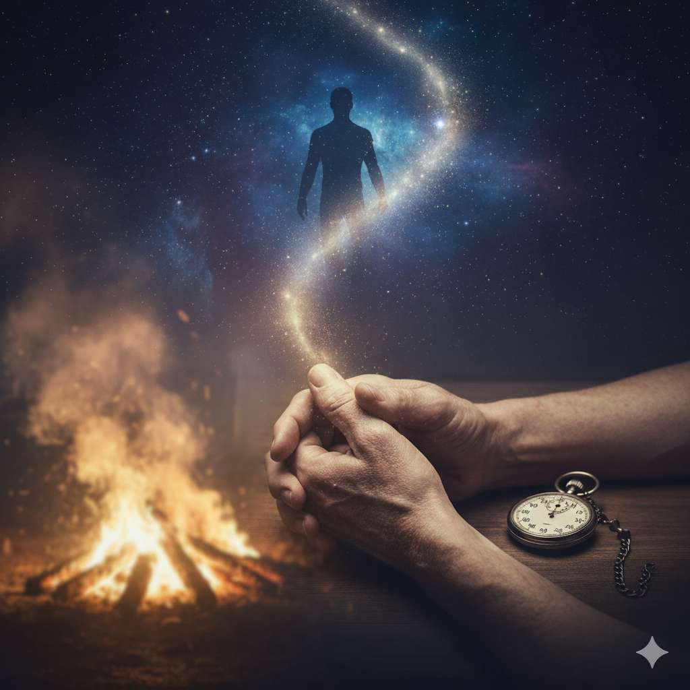

## **A Day of Loss and Clarity**

Today, 22nd Oct, 2025, my _Nana Ji_ (my mom's father) died.

By normal standards, I should have taken the day off work to mourn. But instead, I was actually productive. I'm ending my day by writing this blog post, mostly to make sure I don't forget this day and what it has made me think about.

My sister called me up to share this news this morning as she got it first. I was on my way to the office. I became sad and cried a little. I was sad because I won't get to see a kind person anymore who loved me unconditionally. And trust me, unconditional love is rare.

But at the same time, I also felt relieved. He had been very sick for a long time and was bed-ridden.

He needed help 24/7, and even doing basic things was a painful struggle for him. Although you always want to have your loved ones around, sometimes it's better to let them go. His death was a release from his pain.

I found out this evening that his body was burnt within justthe span of a few hours. There was such urgency to complete the final rites, a hurried compulsion to rush him towards the final flame.

Now, that’s hard to digest. But it also teaches you something very deep: **we are nothing.**

Our body is only useful as long as it can serve others. The moment it stops serving, it’s useless.

This makes me wonder: Why do we get so attached to ourselves? Why do we give ourselves so much importance?

I wish there was a way we could see our own funerals, just to realize that we aren't as important as we thought we were.

Maybe if we saw that, it would help us become less attached to the _results_ of our actions (like praise, money, or success) and more attached to just _doing the actions_ themselves.

Because maybe staying in this world just means doing your part, and nothing else.

Yes, in the end, "you" don't really matter. And death is just the process that relieves you from it all.

With this reflection, I also send a singular wish into the universe:: When my hands can no longer give and my physical form has fulfilled its purpose, let me not be asked to remain. May the universe recall me swiftly, sparing me the long, powerless wait for an end that is already due.
