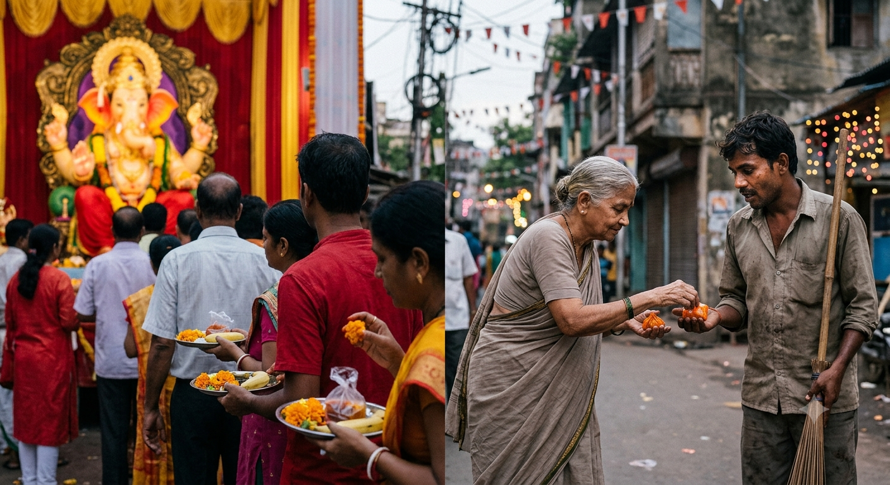

# Why Is There Only One Ram?

Ganesh Chaturthi started today. The pandals are up, the music has begun, and for the next ten days my neighbourhood will not be quiet even once. There is a particular kind of joy that only a festival can put into the air. People are dressed well, sweets are being passed around, somewhere a loudspeaker is slightly too loud, and nobody minds.

I like this. I want to say that first, because what follows might sound like I don't.

Sitting with all of it today, a question came to me that I have not been able to put down. I don't have an answer to it. I am only writing down what I noticed.

I should confess something before I go further. I no longer believe there is some external being sitting somewhere, keeping accounts, waiting to be pleased. What I believe now is that whatever we are calling God has never been outside of us. It is already here. The work is not to reach it, the work is to realise it.

But that is a longer conversation, and not the one I want to have today.

## Nobody is collecting the offering

Look closely at what happens during a puja.

We buy new clothes. We stand in a queue. We offer flowers, fruit, sweets, milk, money. We say the words. And then what? The flowers wilt on the plate. The milk goes down the drain. The prasad is eaten by us. The money stays in this world and is spent by people in this world.

Nothing leaves. Nobody takes it.

I don't say this to mock anyone. I say it because of where it leads. If the offering is never actually received, then the offering was probably never the point. It looks more like a reminder. A small daily rehearsal of giving, of humility, of remembering that you are not the biggest thing in the room.

It looks like training. And somewhere along the way it seems we kept the exercise and lost the thing it was training us for.

## I don't think they came to be worshipped

Suppose you accept the idea of an avatar, that something divine chose to take a human form and walk among us. Then the obvious question is what the point of that was.

It could not have been to prove power. Power does not need a demonstration, it simply acts. If the only goal was to establish that something greater exists, it could have been done in one instant, without a childhood, without a family, without any of the long human middle part.

And look at what those lives actually contained. Exile. Separation. Losing your home and then losing it again. Being misunderstood by the very people you protected. Fighting a war you never wanted. If you were divine and merely performing, why would you write so much pain into your own script?

Maybe because the pain was the syllabus. Not a display of what power looks like, but a demonstration of what a good person looks like under pressure, which is the only condition in which goodness is ever really tested.

## The part I kept avoiding

Here is the thing I find hardest in all of this, and the part I think we have quietly deleted.

Ram did everything right. And his life was misery.

If goodness were rewarded, his life would have been the proof. Instead it is the counter-example. He was exiled for keeping someone else's promise. He lost his wife, won her back through a war, and then lost her again to public opinion. He was doubted by the very people he had saved. The most righteous life we can name was also one of the most unfair.

So I don't think the lesson was ever "be good and good things will come to you."

It looks more like: be good anyway. Be good when it costs you. Be good when nobody notices, when you are blamed for it, when the person you are being good to will never understand what it took. Expect nothing back. Not applause, not fairness, not even a clean reputation.

That is an almost impossible thing to ask of a person. We are built to look for the return. Everything else in life has one. Work gives salary, effort gives result, kindness is supposed to give kindness. This one thing gives nothing, and still asks you to continue.

I think that is where most of us stop. I know it is where I stopped.

## Which is why I understand the other path

Once you see how hard that is, worship stops looking like laziness and starts looking like something very human.

Worship takes a morning. It has a beginning and an end. You can do it fully, sincerely, with tears in your eyes, and go back to your life exactly as you were. It asks nothing of you tomorrow. And at the end of it there is hope, which is the one thing the hard path refuses to give you.

Being good, with no promise of anything, for a whole lifetime, is a much bigger ask. So somewhere inside, quietly, a trade gets made. That I cannot do. But let me at least worship properly. Maybe he will be pleased. Maybe that will count.

I have made that trade myself. I am not describing other people.

I have only stopped believing it works, for one simple reason. Nobody is on the other side of it. Whatever we are calling God is not standing there becoming happier as the offerings increase. Our worship does not reach anyone. It was never a currency. The idea of pleasing was, I think, a story we told ourselves so that the easier path would feel like enough.

## People are good. That is not what I am questioning.

I don't want any of this to sound like I think people are bad. I don't. Most people are trying, in the middle of lives that are much harder than they look from outside.

I know people who have never missed a ritual and who are also deeply kind. I know people who do all of it for their parents rather than for God, which is its own kind of love.

What I have noticed is only that the two things don't travel together as reliably as we assume.

I know people who fast correctly, chant correctly, know every date on the calendar, and are still short with the people who work for them. And I know people who never enter a temple, who would not know one ritual from another, and who are the finest human beings I have met. They are patient with people who can do nothing for them. They tell the truth when it costs them. They speak to a watchman and a CEO with exactly the same face.

If I had to say which group looks closer to God to me, I would not hesitate.

Because if God is not sitting somewhere outside, if God is in all of us, then the real temple is the person standing in front of you right now. The vegetable seller you are arguing with over ten rupees. The colleague who is slower than you. The person whose job it is to clean up after you.

That seems to be the one offering that actually gets received. The only place where something really passes from you to God, because for once, God is there to take it.

## So why is there only one Ram?

Whatever Ram did, he did inside a human life. He walked. He got tired. He grieved. He made decisions that cost him everything. There is not a single thing in that life that a human being is structurally incapable of doing.

So nothing stands between us and that life except our own unwillingness.

Thousands of years. Billions of devotees. Crores spent on temples, lakhs of hours spent in prayer. And not a second Ram. Not one more Krishna.

Not that anyone could be. I certainly can't. That is not really the question. The question is why we are not even in the direction, why nobody's ambition is even shaped that way.

Because if it were, something strange would follow. You would start finding people around you worth bowing to. Not because they are perfect, but because they are visibly trying at the hardest thing there is to try at.

And then we would be worshipping each other. Which would mean the puja never ends. No date on the calendar, no queue, no new clothes. Just an ordinary Tuesday, and someone being decent to a person who cannot repay them, and that being the whole ceremony.

I keep thinking about a world where you cannot point at one person and say, look, that one was the exception. Because everyone is somewhere in that direction. Because the bar moved. Because worship became so ordinary and so spread out that it stopped needing a temple.

If every person you met were worth worshipping, who would you build the shrine for? Where would you even point?

## Where I actually am with this

I should be honest about why this is on my mind.

I have tried to be decent. Not great, not anywhere close to great, but decent. And for a long stretch recently I had more or less given up on it. Because it doesn't work. You are patient and you are treated as someone who can be taken for granted. You are honest and it is used against you. You go out of your way and nobody registers it, and the person who never bothered is doing perfectly fine.

So I had started thinking, quietly, that there is no point in being the extra-good one. That the sensible thing is to give people exactly what they give you, and not a rupee more.

I don't think I believe that anymore. Not because anything changed on the outside. Nothing has. Only that in writing all of this down, I understood what I had been getting wrong.

I was still expecting a return. I had just hidden it better. I thought I was being good, but I was running an account, and when the account stayed empty I called it pointless and wanted to close it.

But if the whole teaching is that there is no return, then an empty account is not a failure. It is the expected reading. The only honest reason left to be good is that you want to be. Not for God, not for fairness, not for anyone to notice. Just because that is what you would rather be.

I will never be Ram. I am not going to pretend otherwise. But I think I can still do a few small things. Not give back the rudeness. Not keep score. Be patient one more time than I want to be.

And I am not going to make it sound noble. Some days it will feel like something is quietly breaking in me while I do it, and I will want very badly to stop.

I don't know if I will manage it. Let's see. But I would rather fail at this than succeed at the other thing.

That is all I have taken from today. The celebration outside is still going on, and it is beautiful, and I hope it stays.

I am just going to try to carry a little of it into tomorrow, where nobody is watching.
