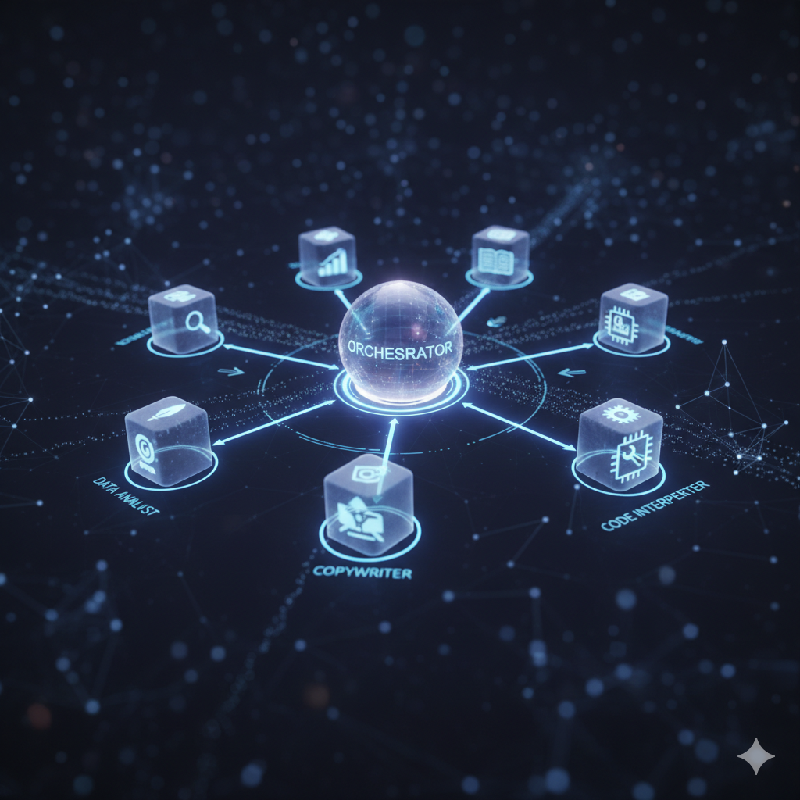

# What is Multi-Agent Architecture?

For decades, the dream of artificial intelligence has been a single, monolithic entity—a HAL 9000 or a Skynet—that could reason, plan, and act on a global scale. But what if the future of AI isn't one super-intelligence, but a team of specialists working in concert?

This is the core idea behind **Multi-Agent Architecture**, a design paradigm that is rapidly gaining traction in the world of AI development. Instead of building one massive, do-it-all model, we can design smaller, specialized AI "agents" that collaborate to solve complex problems. It's the AI equivalent of assembling a team of experts—a strategist, a researcher, a data analyst, and a communicator—to tackle a challenge that no single individual could handle alone.

A great lens through which to understand this concept is [Google's Agent Development Kit ](https://google.github.io/adk-docs/)**(ADK)**, which provides a conceptual framework for building these collaborative AI systems. Let's dive into the core principles of multi-agent architecture, using the ADK's philosophy as our guide.

## What is an "Agent"?

First, let's clarify what we mean by an agent. In the context of the ADK, an agent isn't just a chatbot or a simple script. A true agent is an autonomous system that can:

1. **Perceive its Environment:** It can take in information, whether from a user query, a database, or a live data stream.
2. **Reason and Plan:** It can process that information, break down a goal into smaller, achievable steps, and decide on a course of action.
3. **Act:** It can execute its plan by calling tools, accessing APIs, querying databases, or generating responses.
4. **Learn from Feedback:** It can adapt its behavior based on the results of its actions and feedback from the environment (including from other agents).

Think of an agent as a specialized employee. One might be a **"Database Guru"** who knows exactly how to query complex SQL databases. Another might be a **"Creative Writer"** who excels at generating human-like text. A third could be a **"Code Interpreter"** who can write and execute scripts.

## How Agents Work Together?

The magic of a multi-agent system lies in how these specialized agents communicate and collaborate. A complex user request is rarely a one-step task.

Consider the query: **"Analyze our latest sales data, identify the top-performing product in the last quarter, and draft a marketing email to promote it."**

A single, monolithic AI might struggle with this. It needs to access a database, perform data analysis, identify a specific product, and then switch gears to creative writing. In a multi-agent architecture, this task is elegantly delegated.

Here’s how it would work in a system inspired by the ADK:

1. **The Orchestrator:** At the center of the system is an **Orchestrator** (sometimes called a meta-agent or a controller). This agent doesn't perform the tasks itself; its job is to understand the user's ultimate goal and act as a project manager. It receives the initial prompt and devises a high-level plan.
2. **Task Delegation:** The Orchestrator breaks the goal into sub-tasks and delegates them to the most suitable agents.
    *   **"Analyze our latest sales data..."** -> This task goes to the **Data Analyst Agent**.
    *   **"...and identify the top-performing product..."** -> The Data Analyst Agent processes this and returns the result (e.g., "Product X").
    *   **"...and draft a marketing email to promote it."** -> The Orchestrator takes the result ("Product X") and hands a new task to the **Marketing Copywriter Agent**: "Draft an email for Product X."
3. **Communication and State Management:** As the agents work, they don't just pass messages back and forth randomly. The Orchestrator maintains the "state" of the project—what's been done, what the results are, and what needs to happen next. This is crucial. The Marketing Agent needs to know _which_ product to write about, a piece of information only available after the Data Analyst Agent has completed its work.
4. **Synthesis and Final Output:** Once the Marketing Agent has drafted the email, it returns the text to the Orchestrator. The Orchestrator then assembles the final response for the user, perhaps presenting both the data finding and the drafted email.

This is a simplified example, but it highlights the core strength of this architecture: **modularity and specialization**.

## Why is This a Better Approach?

Building AI systems this way has several powerful advantages:
*   **Efficiency:** Each agent is small and optimized for a specific task. It's much easier to create a great data analysis agent than it is to create a single model that is a great data analyst, a great writer, _and_ a great programmer.
*   **Scalability:** Need a new capability, like video analysis? You don't have to retrain your entire system. You can simply build a new **"Video Analyst Agent"** and plug it into the architecture. The Orchestrator just needs to learn when to delegate tasks to this new team member.
*   **Maintainability and Debugging:** If the marketing emails are poorly written, you know exactly which component to fix: the Marketing Copywriter Agent. This modularity makes debugging and improving the system far more manageable.
*   **Resilience:** If one agent fails, it doesn't necessarily bring down the entire system. The Orchestrator can potentially re-assign the task or try a different approach.

## The Road Ahead

The shift to multi-agent architecture is more than just a technical detail; it's a fundamental change in how we think about building intelligent systems. It's a move away from the lone genius and toward the high-performing, collaborative team.

Frameworks like [Google's ADK](https://google.github.io/adk-docs/) provide the conceptual building blocks for this new era of AI. As developers, the challenge is no longer just about building the most powerful model, but about building the most effective _team_. The future of AI is collaborative, and it's being built one specialized agent at a time.